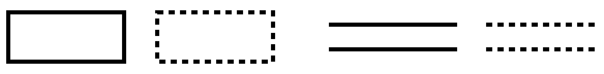
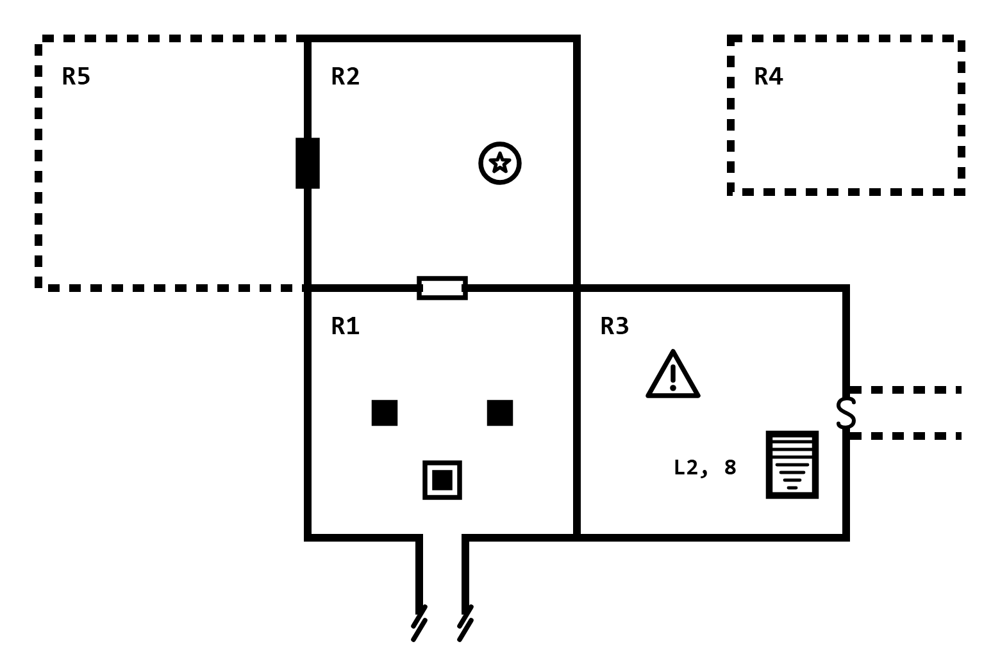
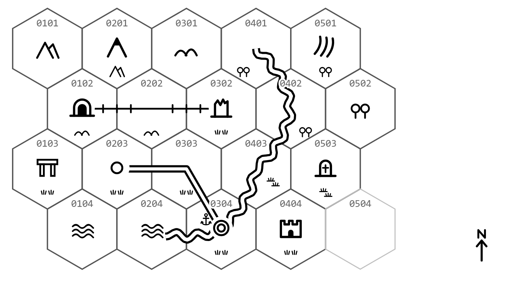

## 1. Introduction

You are three rooms into a ruined abbey. You drew a door between the first two rooms as a gap, and between the next two as a little rectangle. The stairs are a box of lines in one place and an arrow in another. There is a mark in the chapel you can no longer place: a pit, or a well? Two weeks later you cannot read your own drawing.

Maplog is a set of marks for drawing maps while you play. It gives doors, stairs, pits, pillars and walls you are not sure of the same look every time, so a map you drew last month reads as clearly as one you drew today.

### 1.1 Why "Maplog"?

*Map* + *log*. You draw a Maplog map the way you write a log: a little at a time, as you discover things. Where a written log says what happened, the map shows where.

### 1.2 Space on the Map, State in the Log

Maplog draws **what is there**: walls, openings, level changes, traps, fixtures. It does not track **what has happened**: which rooms are cleared, what you have taken, where the party stands. That changes every scene and belongs in your notes.

If you use Lonelog, the Dungeon Crawling Add-on already covers state with the Room tag (`[R:3|cleared, looted]`) and the Dungeon Status Block. Its advice is to let the map handle space and the tags handle state. Maplog is the map half of that split.

### 1.3 Standalone, and Compatible with Lonelog

Maplog is **fully standalone**. You do not need Lonelog to use it. It works with any game system and any note-taking habit, or none.

It is also **compatible with Lonelog**. Room IDs on the map are the IDs in your Room tags, and the connections the Add-on records in text (`exits N:R2`, `E:R7(secret)`, `D:R8`) are the openings Maplog draws. Maplog adds nothing to Lonelog's text notation. Section 12 has the details.

### 1.4 What Maplog Covers

- **Walls and boundaries.** Walls, bars, ledges, the edge of the map.
- **Openings.** Passages, doors, windows, and what a door can be: locked, secret, barred, trapped.
- **Level changes.** Stairs, spiral stairs, slopes, shafts.
- **Pits and traps.** Traps, pits, trapdoors.
- **Fixtures.** Pillars, statues, wells, altars, light, water.
- **Overland maps.** Terrain, rivers and roads, sites and landmarks, settlements.
- **Doubt.** A way to draw what you are not sure of yet.

It leaves out scale, wall style, tools and colour. Those are taste and habit, and they stay yours.

### 1.5 How to Use This Notation

Think of Maplog as a **toolbox, not a rulebook**. It has five rules (Section 3.2) and about seventy marks in two sets, one for sites and one for overland maps. You will use a handful in most sessions.

To start a dungeon, learn eight: the wall, the open passage, the door, the locked door, the secret door, stairs up, stairs down and the trap. To start a hex map, learn the terrain you need, the river, the road, the village and the entrance. Add the rest when a map asks for them.

### 1.6 Quick Start: Your First Map

1. Draw the first room as you find it, and write `R1` inside it.
2. Where you can leave by a door, leave a gap in the wall and draw a small rectangle across it.
3. If the door will not open, fill the rectangle in.
4. Draw a corridor you can see but have not walked with dashed walls.
5. When you walk it, redraw the walls solid, and draw the next room, `R2`.

That is a Maplog map. Everything else in this document is more marks for more situations.

## 2. Design Principles

**Fast.** Every mark takes a few pen strokes. Mapping mid-scene should not stall the game.

**Pencil-proof.** Marks rely on shape, fill and line style, never on colour. They survive pencil, biro, photocopies and greyscale printing.

**Space, not state.** A mark says what is there, not what you did about it. A mark only changes when the place itself changes, or when you learn it was not what you thought.

**Built from parts.** A few base shapes, and small marks added to them. A trapped door is a door with a triangle on it, not a new symbol. You learn the parts once and read the combinations.

**Grid-agnostic.** Marks attach to walls, and to the places between them. That works on square paper, hex paper or a blank page.

**Traditional where it can be.** Many marks follow the conventions of classic dungeon maps, so a Maplog map reads to anyone who has seen one.

## 3. The Grammar

### 3.1 Kinds of Marks

Every mark is one of four kinds, sorted by where it goes.

| Kind          | It goes                                  | Examples                           |
|---------------|------------------------------------------|------------------------------------|
| **Lines**     | Along an edge, or from place to place    | Wall, ledge, border, road, river   |
| **Openings**  | In a gap in a line                       | Passage, door, secret door, bridge |
| **Points**    | Inside a place, where the thing is       | Stairs, trap, statue, village      |
| **Areas**     | Filling part of a place                  | Water, terrain                     |

Beside these, you write a few things in text: IDs, level tags, stair destinations and the scale (Section 3.4).

### 3.2 The Five Rules

1. **Shape says what it is.** A rectangle in a gap is a door. A box of step lines is a staircase. A square is a trapdoor.
2. **Attributes sit on the base.** Small marks and letters added to a base mark change what it is, without replacing it. Draw them on the side of the wall they apply to. A trapped door is a door with a small triangle on it. A covered pit is a pit with a small `C` beside it. A port is a town with a small anchor beside it. The letters are `S` for secret, `C` for covered, `U` for up (on the ceiling) and `?` for illusory.
3. **Down is the narrow end.** Anything that changes level shows the way down by its narrow end or its point: the tapering lines on stairs down, the point of a chevron, the head of the arrow on a spiral stair.
4. **Count grades.** When a mark comes in strengths, draw more of it for more. A steep slope has three chevrons, a slight one has one. A road is two lines and a track is one. A village is one ring, a town two, a city three.
5. **Dashed means unconfirmed.** A dashed line is something you are not sure of yet: a room you have only heard of, a corridor you have not walked, a wall you suspect hides a door (Section 10).

### 3.3 Places and IDs

A **place** is anything you can label: a room, a cave, a hex, a deck. Give every place that matters an **ID**, written inside it. The ID is what ties the map to your notes.

Rooms usually get numbers, and `R1`, `R2` and so on works well. If you are running a published dungeon, use its own room numbers. Hexes take coordinates (Section 11.3).

### 3.4 Write-ins

Only a few things are ever written on a Maplog map:

- **IDs**, inside places: `R3`.
- **Level tags**, on a map with more than one level: `L1` in a corner of the map, or `L2` on a room drawn at another depth.
- **Stair destinations**, beside a staircase: `L3, 1` means "to level 3, room 1".
- **Names**, where a name helps you find a place again: `Chapel`, `Orc Warren`, the name of a realm.
- **The scale**, in a corner of an overland map: `1 hex = 6 mi`.

Everything else belongs in your notes.

## 4. Walls and Boundaries

Lines run along the edges of places.

|                                   Mark                                    | Meaning                                                                                                                    |
|:-------------------------------------------------------------------------:|----------------------------------------------------------------------------------------------------------------------------|
|       {width=76px}           | **Wall.** Draw it as a thick line. Every other line and opening sits on it.                                                |
| {width=41px} | **Off-map edge.** A passage that leaves the part of the map you have drawn. End its walls with two short slanted breaks. |
| {width=80px} | **Bars.** Bars, a grate or a portcullis: you can see and shout through it, but not walk. Break the wall with a row of dots. |
| {width=74px} | **Ledge.** A drop-off. Draw a thin line with ticks on the lower side.                                                  |

## 5. Openings

An opening is a gap in a wall where you can pass from one place to another. Leave the gap in the wall line and draw the opening across it.

|                                   Mark                                    | Meaning                                                                                                   |
|:-------------------------------------------------------------------------:|-----------------------------------------------------------------------------------------------------------|
|      {width=80px}     | **Open passage.** A gap with nothing in it.                                                               |
| {width=80px} | **Door.** A way through that you can open. Draw a small rectangle across the gap.         |
| {width=138px} | **Double door.** Two rectangles side by side.                                         |
| {width=80px} | **Window.** You can see through, and perhaps climb. A thin line across the gap, closed by two ticks. |
| {width=80px} | **Collapsed.** A way through that is blocked by rubble. Draw a jagged line across the gap. |

### 5.1 What a Door Can Be

A door's attributes follow rule 2: the door stays a door, and small marks say what kind. Draw them on the side of the wall they apply to. For a door you cannot see, the secret door and the illusory wall, the letter goes on the wall itself.

|                                   Mark                                    | Meaning                                                                                              |
|:-------------------------------------------------------------------------:|------------------------------------------------------------------------------------------------------|
| {width=80px} | **Locked.** Draw the rectangle solid.                                              |
| {width=80px} | **Secret.** A hidden way through, drawn once you find it. Write an `S` on the wall.             |
| {width=80px} | **Barred.** Barred from one side. Two short strokes on the side the bar is on.          |
| {width=80px} | **Trapped.** A small triangle on the side the trap is on.                            |
| {width=80px} | **One-way.** You can pass only in the direction of the arrow.                                   |
| {width=80px} | **Illusory.** A wall that is not really there. Write a `?` on the wall.                     |

Attributes combine. A locked, trapped door is a solid rectangle with a triangle on it:

{width=80px}

When a locked door opens, redraw it hollow. If you only suspect a secret door, draw that stretch of wall dashed (Section 10).

## 6. Level Changes

These marks follow rule 3: down is the narrow end.

|                                   Mark                                    | Meaning                                                                                                                  |
|:-------------------------------------------------------------------------:|--------------------------------------------------------------------------------------------------------------------------|
| {width=36px} | **Stairs up.** A box filled with evenly spaced step lines.                                    |
| {width=36px} | **Stairs down.** The same box, but the step lines shorten toward the way down.          |
| {width=40px} | **Spiral stairs.** A spoked circle. The arrow shows the way you turn going down.                         |
| {width=28px} | **Slope.** Chevrons pointing down the slope: three for steep. Also use it for a chute. |
| {width=30px} | **Shaft.** A vertical hole in the floor. Add a `U` if it opens in the ceiling instead.                               |

Rules 2 and 4 give the variants:

| Mark | Meaning |
|:-:|---|
| {width=28px} | **Gentle slope.** Two chevrons. |
| {width=28px} | **Slight slope.** One chevron: you would only notice it by rolling a marble. |
| {width=44px} | **Shaft in the ceiling.** |

Stairs are drawn inside the place they start from, and a staircase joins two levels. On each level, draw it the way it goes from there: stairs down on the upper level, stairs up on the lower one. Write where it leads beside it (Section 11.2).

## 7. Pits and Traps

|                                   Mark                                    | Meaning                                                                                                  |
|:-------------------------------------------------------------------------:|----------------------------------------------------------------------------------------------------------|
| {width=37px} | **Trap.** A trap or danger you know about. Draw a triangle with an exclamation mark. Use it for anything that is not a pit or a trapdoor. |
| {width=28px} | **Pit.** An open hole in the floor. A square with a solid centre.                                 |
| {width=28px} | **Trapdoor.** A hatch in the floor. An empty square.                                                            |

The letters from rule 2 turn these into their variants:

| Mark | Meaning |
|:-:|---|
| {width=41px} | **Covered pit.** A pit hidden under a lid or a false floor. |
| {width=41px} | **Secret trapdoor.** |
| {width=41px} | **Trapdoor in the ceiling.** |

The trap mark says where the danger is. Whether it has gone off or been disarmed is state, and goes in your notes.

## 8. Fixtures and Ground

Fixtures are things in a room that do not move and that you will want to find again.

|                                   Mark                                    | Meaning                                                                                     |
|:-------------------------------------------------------------------------:|---------------------------------------------------------------------------------------------|
| {width=20px}         | **Column.** A pillar or column. A small solid square.                                       |
| {width=30px}   | **Statue.** A circle with a star.                                                           |
| {width=30px}     | **Well.** A circle with a wave. Also a fountain.                                            |
| {width=30px}   | **Altar.** A block with a small cross on top.                                               |
| {width=33px}      | **Light.** A lit brazier, a glowing crystal, anything that lights the room.                 |
| {width=55px}        | **Water.** Fill the area with wavy lines, as much of the room as the water covers.          |

Chests, tables, beds and other furniture are left to you. Draw them simply, or write the name.

## 9. Overland Marks

An overland map is the map you travel across, usually drawn on hexes. These marks work on hex paper or a blank page. Section 11.3 shows where they go in a hex.

### 9.1 Terrain

Terrain is an area mark. On a hex map, draw one in each hex you have seen. On a map drawn freehand, repeat it across the area it covers.

|                                   Mark                                    | Meaning                                                           |
|:-------------------------------------------------------------------------:|-------------------------------------------------------------------|
| {width=33px}          | **Plains.** Grassland, steppe, open country.                      |
| {width=32px}          | **Forest.** Draw more trees for denser woods.                     |
| {width=31px}              | **Jungle.**                                                       |
| {width=38px}         | **Hills.**                                                        |
| {width=37px}     | **Mountains.**                                                    |
| {width=34px} | **Desert.** Sand, dunes, dust.                              |
| {width=33px} | **Swamp.** Marsh, bog, fen.                                     |
| {width=36px}          | **Water.** Sea, lake. The same mark as water in a site.           |
| {width=26px}       | **Ice.** Tundra, glacier, snowfield.                              |

For other terrain, such as farmland, badlands or lava fields, draw your own mark or write the name.

### 9.2 Relief and Boundaries

|                                   Mark                                    | Meaning                                                                                              |
|:-------------------------------------------------------------------------:|------------------------------------------------------------------------------------------------------|
| {width=73px} | **Border.** The edge of a realm or region. A thin line with small circles on it. On a hex map, draw it along hex edges, and write the realm's name inside. |
| {width=74px} | **Cliff.** The ledge mark from Section 4, at the scale of the land: ticks on the lower side. |
| {width=30px} | **Peak.** A single mountain worth naming. A peak with a solid cap.                                  |
| {width=23px} | **Pass.** A way through mountains or hills. Two arcs facing away from each other, across the ridge. |

A **coastline** needs no mark of its own: draw the shore as a plain line, with the water mark on the water side.

### 9.3 Routes and Water

Routes follow rule 4. A road is two lines, a track one, a trail one line with ticks across it. Rivers work the same way but wave: two wavy lines for a river, one for a stream.

|                                   Mark                                    | Meaning                                                                                  |
|:-------------------------------------------------------------------------:|------------------------------------------------------------------------------------------|
| {width=71px}           | **Road.** Built and kept up. Wagons can use it.                                          |
| {width=73px}                    | **Track.** Beaten earth. Carts in good weather.                                          |
| {width=73px} | **Trail.** A path you can follow on foot, and not always easily.                    |
| {width=77px}              | **River.** Too wide or deep to wade.                                                     |
| {width=73px}              | **Stream.** You can wade it.                                                             |
| {width=77px} | **Bridge.** Two short lines across the river, their ends flared.       |
| {width=77px} | **Ford.** A place to wade a river. Three stepping stones across it.           |
| {width=77px} | **Ferry.** A small boat on the river.                                                |

On a hex map, draw roads, tracks and trails from the centre of one hex to the centre of the next. Rivers can run through hexes or along their edges.

A route across open water is a **sea lane**. Draw it as a track: a single line over the water mark.

### 9.4 Sites and Landmarks

|                                   Mark                                    | Meaning                                                                                               |
|:-------------------------------------------------------------------------:|-------------------------------------------------------------------------------------------------------|
| {width=36px} | **Entrance.** The way into a cave, a dungeon or a mine. This is the hex's link to a site map (Section 11.5). |
| {width=32px}      | **Ruin.** A broken wall. Anything fallen down that you can walk around in.                           |
| {width=32px}      | **Tomb.** A tomb, a barrow, a crypt, a graveyard.                                                     |
| {width=31px} | **Standing stones.** Also a monument or any old stone raised on purpose.                        |
| {width=30px} | **Shrine.** A holy place outside a settlement.                                            |
| {width=30px}              | **Lair.** Where something dangerous lives. The mark is the place; the creature goes in your notes.   |

### 9.5 Settlements

The size of a settlement follows rule 4: count the rings.

|                                   Mark                                    | Meaning                                                                        |
|:-------------------------------------------------------------------------:|--------------------------------------------------------------------------------|
| {width=23px}          | **Homestead.** A single farm or dwelling.                                      |
| {width=12px}               | **Hamlet.** A handful of houses.                                               |
| {width=21px}                 | **Village.**                                                                   |
| {width=25px}                   | **Town.**                                                                      |
| {width=30px}                 | **City.**                                                                      |
| {width=32px} | **Castle.** A castle or a walled keep.                               |
| {width=21px} | **Tower.** A fort, a watchtower, a lone tower.                                 |
| {width=30px}  | **Inn.** An inn or a waystation on the road.                                   |

Two attributes follow rule 2, drawn small beside a settlement:

| Mark | Meaning |
|:-:|---|
| {width=41px} | **Port.** An anchor beside the settlement. |
| {width=37px} | **Temple.** The shrine beside the settlement. A monastery alone in the hills is just a shrine. |

### 9.6 Regions

Regions need no new marks:

- **A realm:** a border and a name.
- **A dangerous area:** outline it with a thin line and put a trap mark inside (Section 7). What makes it dangerous goes in your notes.
- **Anything else,** such as a cursed wood or a stormy sea: outline it and write its name.

### 9.7 North and Scale

| Mark | Meaning |
|:-:|---|
| {width=18px} | **North.** Draw it in a corner if north is not the top of the page. |

Write the scale in a corner as text: `1 hex = 6 mi`.

## 10. Dashed: Not Yet Confirmed

Draw a line or outline dashed to say you are not sure of it yet. It is the one Maplog mark about what you know rather than what is there.

{width=100%}

Use it for:

- **A room you know of but have not seen**, such as one marked on a captured map, or one you glimpsed through a door. Draw its walls dashed, or float a dashed box with its ID if you do not know where it is.
- **A corridor you have not walked.** Draw its walls dashed, leading away from the opening.
- **A secret door you suspect.** Draw that stretch of wall dashed.
- **A road you have only heard of, or a route you only plan.**

When it is confirmed, redraw it solid. A dashed line is never a grade or a kind of wall: if a mark comes in strengths, it uses count (rule 4), never dashes.

## 11. Using Maplog

### 11.1 Site Maps

A site map is the map of a place you enter: a dungeon, a cave, a ruin, a building. Draw it as you go:

- **New room:** draw what you can see of it, and write its ID.
- **New opening:** mark it on the wall.
- **New corridor or room glimpsed:** draw it dashed.
- **Something found:** add the mark where it is.
- **Something learned:** redraw dashed lines solid, and fix what you got wrong.

This map is drawn from a short Lonelog log, so you can see the notes and the drawing side by side.

```
[R:1|cleared, looted|entry cave|exits N:R2, E:R3]
=> Two pillars hold up the roof, and a pit gapes by the way in.
[R:2|cleared|guard room|exits S:R1, W:R5]
=> A statue of a knight faces the door.
[R:5|locked|heavy door|exits E:R2]
[R:3|active, trapped|library|exits W:R1, E:R6(secret), D:R8]
=> A trapped chest, and stairs down to the second level.
[R:4|unexplored|marked on the guard's map]
```

{width=100%}

Reading it:

- **R1** has a way in from the south that runs off the map, two columns, and a pit in front of the entrance. A door leads north to R2 and an open passage east to R3.
- **R2** has a statue. The locked door on its west wall is the heavy door to **R5**.
- **R5** is drawn dashed. You have seen its door, not the room, so you do not know its shape.
- **R3** has a trap (the chest), stairs down to level 2, room 8 (`L2, 8`), and a secret door in the east wall. The dashed corridor behind it leads toward R6, which you have not walked.
- **R4** is a dashed box floating on its own. You know it exists from the guard's map, not where it is.

None of the rooms shows whether it is cleared or looted. That is in the log.

### 11.2 Several Levels

Draw each level as its own map, and give it a level tag (`L1`, `L2`) in a corner. Pair the stairs: stairs down on the upper level with the destination beside them (`L2, 8`), and the matching stairs up on the lower level (`L1, 3`).

{width=43px}

If one room sits at a different depth from the rest of its map, write its level tag beside its ID.

### 11.3 Overland Maps

Use hex paper or any hex tool. Pointy-top or flat-top makes no difference to the marks.

- **IDs.** Write each hex's ID at its top: column then row, two digits each, counted from 1. Hex `0203` is column 2, row 3. If your paper already prints coordinates, use those.
- **Terrain.** One terrain mark per hex, in the middle.
- **Sites and settlements.** Draw them in the middle of the hex, and move the terrain mark below, smaller.
- **Routes.** Roads, tracks and trails run from centre to centre. Rivers run through hexes or along their edges. Where a route crosses a hex, move the terrain mark out of its way.
- **Fog.** Leave hexes you have not seen blank.
- **Dashed** works here too: a rumoured road, a route you plan.

{width=100%}

Reading it:

- **0102** has the entrance to a site in the hills. A trail runs east from it, through 0202, to a ruin on the plains in **0302**.
- **0201** is a named peak among the mountains.
- **0203** is a village, with a road to the town in **0304**. The town is a port: the river reaches the sea there.
- The **river** rises in the forest in 0401 and runs through 0402 and the swamp in 0403 to the town.
- **0103** has standing stones, **0503** a tomb in the swamp, **0404** a castle, and **0501** a lair in the forest.
- **0504** is blank: you have not seen it.

Nothing on the map says where the party is or which hexes it has visited. That is in the log (Section 12.4).

### 11.4 Other Maps

Anything with labelled places takes the same marks: a point-crawl, the decks of a ship, a manor, a city's districts. Treat each labelled place as a room, and each link between places as an opening.

### 11.5 Linking Maps

When one map leads to another, write the connection on both. If a hex holds a dungeon, draw the entrance mark in the hex with the dungeon's name beside it, and write "from 0102" beside the way in on the dungeon's map. For a multi-level site, the stair destinations do the linking (Section 11.2).

## 12. Working with Lonelog

### 12.1 What "Compatible" Means

- Maplog adds nothing to Lonelog's text notation: no symbols, no tags, no block syntax.
- The IDs on the map are the IDs in the Room tags, and hex IDs are the names in Location tags.
- The connections the Dungeon Crawling Add-on can record in text are the ones Maplog draws.
- Neither needs the other. Use the log alone, the map alone, or both.

### 12.2 Who Records What

| The map (Maplog)                               | The log (Lonelog)                                             |
|------------------------------------------------|---------------------------------------------------------------|
| Where rooms are, and their shape               | What a room is: `library`                                     |
| How rooms connect, and through what            | Optionally, the same connections: `exits N:R2, E:R3`          |
| That a door is locked                          | Why, and whether you have the key: `locked`                   |
| Where a trap is                                | Whether you know of it, set it off or disarmed it: `trapped`  |
| What you are not sure of (dashed)              | Where the rumour came from                                    |
| What each hex holds                            | Where the party is, and which hexes it has visited            |
|                                                | Cleared, looted, active, safe: everything that happened       |

### 12.3 Exits and Openings

| Lonelog | Maplog |
|---|---|
| `exits N:R2` | an opening on the north wall, leading to R2 |
| `E:R7(secret)` | a secret door (`S`) on the east wall |
| `exits U:R8`, `exits D:R8` | stairs up or down, with the destination beside them if R8 is on another level |
| R5 is `locked` | a locked door on the way into R5 |
| R5 is `collapsed` | collapsed openings on the way into R5 |
| R4 is `unexplored` | R4 drawn dashed, if you have not seen it |

The Add-on marks a lock or a collapse as a status of the room. Maplog draws it on the door or passage you would use to get in. It is the same fact, drawn where you would meet it.

### 12.4 Hexes in a Lonelog Log

The core `[L:]` location tag already works for hexes. Use the hex ID as the name, and the log records what the map does not: that you are there, and what happened.

```
[L:0304|port town|arrived day 3]
[L:0501|lair|wolves, avoided]
```

Nothing new is needed on the Lonelog side.

### 12.5 Keeping Map and Log in Step

- **Draw when you write the `exits`.** When a new connection goes in the log, it goes on the map too.
- **Let the log hold state.** Do not track cleared rooms on the map. The Dungeon Status Block does that, and it is easier to rewrite than a map.
- **Notes still work.** If you cannot stop to draw, write a reminder such as `(note: add R9 to map)`.
- **When they disagree, fix one.** Decide which is right and correct the other.

### 12.6 Using Maplog Without Lonelog

Nothing in Maplog depends on Lonelog. Keep state in whatever notes you like, or in your head.

## 13. Analog and Digital

### 13.1 On Paper

Use graph paper for rooms, hex paper for hexes, or a blank page. Pencil is fine, and an eraser helps: a door that turns out to be locked, or a dashed corridor you have walked, means redrawing. Keep a copy of the Quick Reference in the notebook, and it will do the job of a legend.

### 13.2 On Screen

Any drawing or mapping tool that lets you place small shapes will do. The marks are published as an SVG sheet (`marks.svg`) alongside this document, under the same licence, so you can import them as stamps or symbols.

In a Markdown log, embed the map as an ordinary image between scenes, or at the start or end of a session:

```

```

If you play on paper, photograph the page and treat the photo the same way.

## 14. Best Practices

**Do draw what you see, when you see it.** Don't wait for the end of the scene: by then you will not remember which wall the door was on.

**Do draw unconfirmed things dashed.** Don't draw a rumour solid, or you will forget which parts you have verified.

**Do label the places that matter.** Don't put an ID on every corridor. A place needs one when you will write about it or come back to it.

**Do keep state in your notes.** Don't cover the map with ticks and crosses for cleared and looted. The map stays readable, and the notes stay easy to update.

**Do add attributes to a base mark.** Don't invent a new door for every kind of door.

**Do keep the Quick Reference in view while you learn.** After a few sessions you will not need it.

---

## 15. Quick Reference

### Rules

1. Shape says what it is.
2. Attributes sit on the base: small marks on the side they apply to, letters beside (`S` secret, `C` covered, `U` ceiling, `?` illusory).
3. Down is the narrow end.
4. Count grades.
5. Dashed means unconfirmed.

### Marks

| Mark | Name | | Mark | Name |
| :-: | --- | --- | :-: | --- |
| {width=52px} | Wall | | {width=24px} | Stairs up |
| {width=28px} | Off-map edge | | {width=24px} | Stairs down |
| {width=54px} | Bars | | {width=27px} | Spiral stairs |
| {width=50px} | Ledge | | {width=19px} | Slope |
| {width=54px} | Open passage | | {width=20px} | Shaft |
| {width=54px} | Door | | {width=25px} | Trap |
| {width=93px} | Double door | | {width=19px} | Pit |
| {width=54px} | Window | | {width=19px} | Trapdoor |
| {width=54px} | Collapsed | | {width=14px} | Column |
| {width=54px} | Locked door | | {width=20px} | Statue |
| {width=54px} | Secret door | | {width=20px} | Well |
| {width=54px} | Barred door | | {width=20px} | Altar |
| {width=54px} | Trapped door | | {width=22px} | Light |
| {width=54px} | One-way door | | {width=37px} | Water |
| {width=54px} | Illusory wall | | | |

### Overland Marks

| Mark | Name | | Mark | Name |
| :-: | --- | --- | :-: | --- |
| {width=22px} | Plains | | {width=52px} | Ferry |
| {width=21px} | Forest | | {width=24px} | Entrance |
| {width=21px} | Jungle | | {width=21px} | Ruin |
| {width=25px} | Hills | | {width=21px} | Tomb |
| {width=25px} | Mountains | | {width=21px} | Standing stones |
| {width=23px} | Desert | | {width=20px} | Shrine |
| {width=22px} | Swamp | | {width=20px} | Lair |
| {width=24px} | Water | | {width=15px} | Homestead |
| {width=17px} | Ice | | {width=8px} | Hamlet |
| {width=49px} | Border | | {width=14px} | Village |
| {width=20px} | Peak | | {width=17px} | Town |
| {width=15px} | Pass | | {width=20px} | City |
| {width=47px} | Road | | {width=21px} | Castle |
| {width=49px} | Track | | {width=14px} | Tower |
| {width=49px} | Trail | | {width=20px} | Inn |
| {width=52px} | River | | {width=19px} | Port (beside a settlement) |
| {width=49px} | Stream | | {width=25px} | Temple |
| {width=52px} | Bridge | | {width=12px} | North |
| {width=52px} | Ford | | | |

The ledge doubles as a cliff, and a track drawn over water is a sea lane.

### Write-ins

| Kind | Where | Example |
| --- | --- | --- |
| Room ID | Inside the room | `R3` |
| Hex ID | Top of the hex: column, row, from 1 | `0203` |
| Level tag | Corner of the map, or beside a room ID | `L2` |
| Stair destination | Beside the stairs: level, room | `L3, 1` |
| Name | Where it helps | `Chapel` |
| Scale | Corner of an overland map | `1 hex = 6 mi` |

## 16. FAQ

**Q: Do I have to learn all the marks?**  
A: No. Start with the few in Section 1.5 and add marks when a map asks for them.

**Q: How do I show that a room is cleared?**  
A: Maplog doesn't. Whether a room is cleared, looted or safe changes as you play, and it belongs in your notes. In Lonelog, the Dungeon Crawling Add-on's Room tag and Dungeon Status Block do that job. If you want something on the paper as well, a mark beside the ID is your own habit, not part of Maplog.

**Q: How do I show where the party is on a hex map?**  
A: In the log, with a Location tag such as `[L:0304|arrived]`. At the table, a coin or a pencil dot you rub out as you move does the job, but it is not part of the map.

**Q: Why is "locked" a door mark?**  
A: Because that is where you meet it. A lock belongs to the way in, and the room behind it can have other ways in.

**Q: Can I use colour?**  
A: Yes, if you like. No mark depends on it, so a map drawn in pencil reads the same as one drawn in five colours.

**Q: What about monsters, treasure and people?**  
A: They move, get killed and get taken, so they are state and go in your notes. If you want a reminder on the map, write a name.

**Q: Can I add my own marks?**  
A: Yes. Keep to the rules: let shape say what a thing is, add attributes to a base mark rather than inventing a new one, and use dashes only for "unconfirmed". Don't reuse a Maplog shape for something else, and add your marks to the legend you keep with the map.

**Q: What if I map with a computer tool that already has its own icons?**  
A: Use its icons where they suit you, and Maplog's marks where they do not. What matters is that the same thing always looks the same on your maps.

## Credits & License

© 2026 Roberto Bisceglie

Maplog is a companion to [Lonelog](https://zeruhur.itch.io/lonelog), the standard notation for solo RPG session logging.

Several marks are adapted from *DUNGEON.PPT* by Roger S. G. Sorolla (2011), released under CC BY-SA 3.0.

**Version History:**

- v 0.2.0: Refocused on drawing the map; room state left to the log. Added boundaries, door attributes, level changes, pits and traps, fixtures, and the overland set (terrain, relief, routes, sites, settlements).
- v 0.1.0: First draft

This work is licensed under the **Creative Commons Attribution-ShareAlike 4.0 International License**.

You are free to share and adapt this material, provided you give appropriate credit and distribute adaptations under the same license. Maps and logs you make using this notation are your own work and are not subject to this license.
